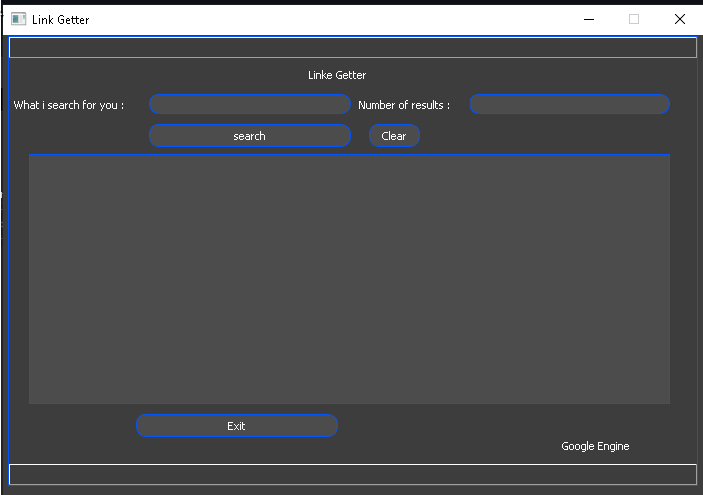
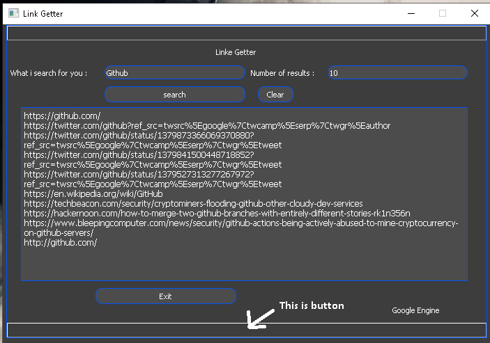
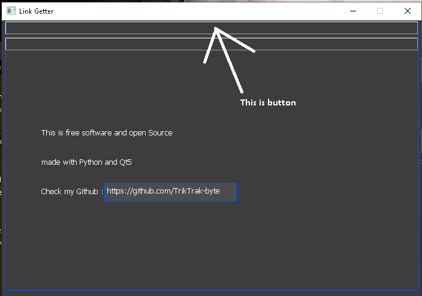

# LinkGetter
________________________________________________________________________________
This is programme with user interface to get links from google.
_______________________________________________________________________________
If you when use LinkGetter.exe just download and run the programme.
Programme size 35 MB so i can't upload it in github
the executable file :[GOOGLE DRIVE ](https://drive.google.com/drive/folders/1wOK0_QcwROJ2uidU1oxPYUXpG-Hq7705?usp=sharing)  
after downloading the file (LinkGetter.exe) you should
copy the file (LinkGetter.exe) and paste it in same folder with main.ui  file
_______________________
if you when use main.py you should install google and PyQt5 modules 
to run python file use command : 
python3 main.py
________________________________________________________________________________
how to install required modules (google and PyQt5) ?
just google it !! (search in google)
_________________________________________________________________________________

